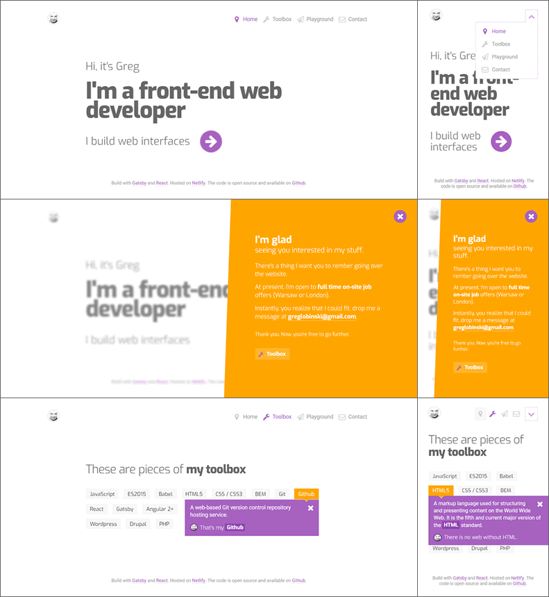

# Greg's playground

That's the code of my website (www.greglobinski.com)


### Build with

* [Gatsby](https://github.com/gatsbyjs/gatsb)
* [React](https://github.com/facebook/react)


### Starting point

* [gatsby-starter-hello-world](https://github.com/gatsbyjs/gatsby-starter-hello-world)


### Additional plugins and packages

* [gatsby-plugin-postcss-sass](https://github.com/gatsbyjs/gatsby/tree/master/packages/gatsby-plugin-postcss-sass)
* [gatsby-plugin-react-helmet](https://github.com/gatsbyjs/gatsby/tree/master/packages/gatsby-plugin-react-helmet)
* [gatsby-plugin-netlify](https://github.com/gatsbyjs/gatsby/tree/master/packages/gatsby-plugin-netlify)
* [gatsby-plugin-nprogress](https://github.com/gatsbyjs/gatsby/tree/master/packages/gatsby-plugin-nprogress)
* [react-redux](https://github.com/reactjs/react-redux)
* [redux](https://github.com/reactjs/redux)  
* [autoprefixer](https://github.com/postcss/autoprefixer)
* [react-icons](https://github.com/gorangajic/react-icons)
* [react-obfuscate](https://github.com/coston/react-obfuscate)
* [Exo and Roboto fonts through typefaces](https://github.com/KyleAMathews/typefaces)


## Instalation

1. Install gatsby-cli ([docs](https://www.gatsbyjs.org/tutorial/part-one/#install-the-hello-world-starter))
2. Clone the repository to your localhost
```
git clone git@github.com:greglobinski/playground.git new-folder
```
3. Install dependencies 
```
yarn install
```
4. Run in developement ([docs](https://www.gatsbyjs.org/docs/))
```
gatsby develp
```
5. Have fun.


    
## Screenshots

